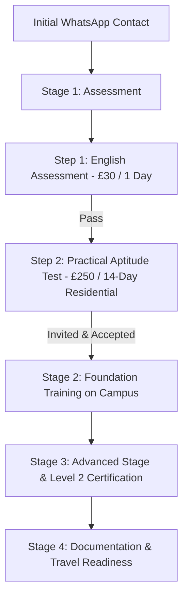

# Deep-Dive Analysis of Bangladesh Training Institute (bt.institute)

---

## 1. What is BTI (Bangladesh Training Institute)?

**Bangladesh Training Institute Limited (BTI)** is a dedicated vocational training institute and residential campus located at **Level 3, Grand Sylhet Hotel & Resort, Airport Road, Sylhet, Bangladesh**.

### The Core Idea:
In Bangladesh, many graduates holding degrees or diplomas in **Civil Engineering** or **Architecture** face limited high-paying job opportunities locally. Meanwhile, countries like the **United Kingdom** have massive shortages of skilled manual construction labour due to an ageing workforce, retrofitting needs, and ambitious national housing targets. 

BTI bridges this gap by training engineering/architecture graduates to obtain an internationally recognized **UK Level 2 vocational trade qualification** (starting with Bricklaying), combining their engineering theoretical knowledge with certified hands-on craftsmanship.

---

## 2. Who is it For?

* **Civil Engineering Graduates (BSc)**
* **Diploma Engineers (Civil / Construction)**
* **Architecture Graduates (B.Arch)**

### Why would an Engineer work with their hands?
In the UK and Western construction industries, **working on the tools is respected and provides the fastest legal route onto active construction sites**. Graduates do not stay at the bottom; because they understand structural drawings, math, and sequencing from their degrees, they are equipped to rapidly rise:
1. **Entry:** Qualified Tradesperson (starting benchmark: ~**£33,400 / Tk 55 Lac/year**)
2. **Step 2:** Chargehand (leading small teams/gangs)
3. **Step 3:** Site Supervisor / Foreman (drawings, safety, materials)
4. **Step 4:** Site Management

---

## 3. How It Works: The 4-Stage Operational Pipeline

### Stage 1: Assessment (Gatekeeping & Evaluation)
You pay **zero programme fees** until you pass both assessment steps:
* **Step 1 — English Assessment (£30):**
  * 1-day evaluation at the Sylhet centre.
  * Assesses spoken and written communication needed on a real construction site (understanding instructions and communicating back).
* **Step 2 — Practical Aptitude Test (£250, Residential):**
  * 14-day stay at the Sylhet campus (meals and accommodation included).
  * Evaluates **Coordination**, **Care for tools/safety**, **Patience**, and **Ability to listen and learn**.
  * No prior trade skill required; it tests whether the candidate has the physical and mental aptitude for trade work.

---

### Stage 2 & 3: Foundation & Advanced Training
* **Duration:** 3 to 8 months (residential in Sylhet).
* **Campus Life:** Accommodation, meals, workshops, and practice yards all in one facility.
* **Three integrated learning tracks:**
  1. **Hands-on trade craft:** 6+ hours daily on tools working to British standards.
  2. **Workplace English:** Terminology, site briefings, verbal commands.
  3. **UK Site Conduct & Safety:** Health & safety regulations, UK building codes, drawing interpretations.
* **Certification:** Practical competence assessment leading to a **Level 2 UK vocational qualification**.

---

### Stage 4: Documentation & Travel Preparation
* Assistance with travel readiness, technical paperwork, and certifications (charged at actual third-party cost).

---

## 4. Programme Payment Models

The total fee is identical across both routes and presented transparently in writing during assessment:

| Feature | Standard Programme | Bootcamp Programme |
| :--- | :--- | :--- |
| **Model** | Lower barrier to start | Priority seat reservation |
| **Initial Payment** | Smaller initial payment when training begins | Bulk of the programme fee paid at start |
| **Later Payment** | Larger balance paid at advanced stage | Smaller remaining balance at advanced stage |
| **Best For** | Candidates preferring flexible cash flow | Candidates wanting their seat guaranteed early |

---

## 5. Active Trades & Future Roadmap

* **Currently Active / Enrolling:** **Bricklaying** (Intake: August)
* **Next Up:** **Plumbing**
* **Future Markets Under Development:** United Kingdom (primary), with Italy, Japan, and Australia in research & development.

---

## 6. What Makes BTI Unique / Business Strengths

1. **Anti-Broker Transparency:** 
   * Explicitly disclaims job or visa guarantees to distance itself from fraudulent overseas employment brokers.
   * Encourages parents/families to inspect the campus in person in Sylhet before spending any money.
2. **Integrated Campus in Sylhet:** 
   * Fully equipped training yard, workshop, accommodation, and dining facilities at Grand Sylhet Hotel & Resort area.
3. **Bilingual Frictionless Conversion:** 
   * Complete English & Bangla documentation with one-click direct WhatsApp integration (`+880 1339 939059`) answered by human staff.
