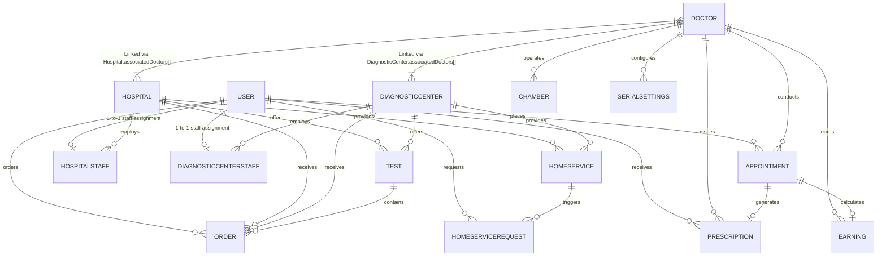
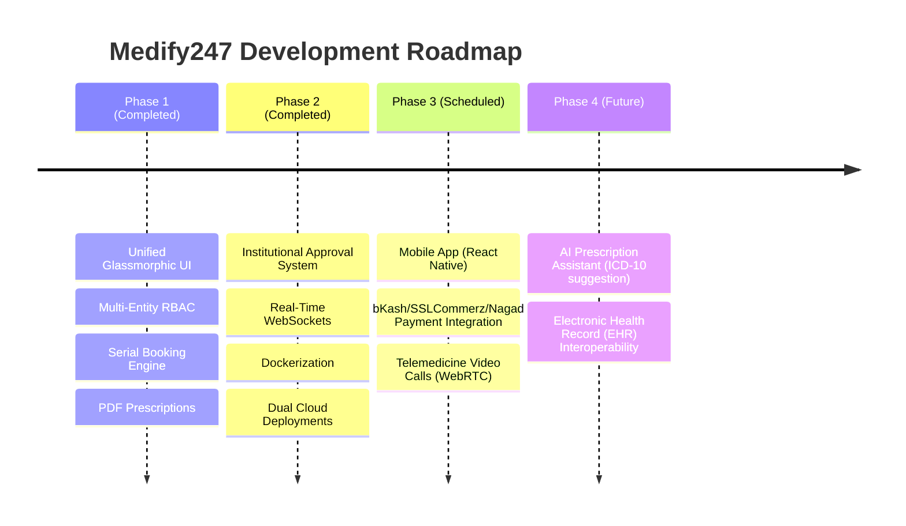

# Medify247 — Enterprise Architecture & Technical Specification

> **Medify247** is a production-deployed, multi-tenant healthcare software-as-a-service (SaaS) platform tailored for South-Asian medical ecosystems. It unifies **Patients**, **Doctors**, **Hospitals**, **Diagnostic Centers**, and a **Super Admin** within a tenant-isolated architecture featuring 7-role RBAC, real-time WebSocket notifications, serial-based scheduling, and automated PDF medical workflows.

---

## 📋 Feature Implementation & Development Matrix

| Capability / Feature | Status | Implementation Mechanism / Details |
|---|:---:|---|
| **7-Role System Architecture** | ✅ Implemented | Roles across `User` collection (`patient`, `hospital_admin`, `diagnostic_center_admin`, `super_admin`, `super_admin_staff`) + separate `Doctor` collection (`doctor`, `doctor_staff`) |
| **Multi-Tenant Isolation** | ✅ Implemented | Logical tenant scoping via `hospitalId`/`centerId` and middleware guards (`hospitalGuard`, `diagnosticCenterGuard`) |
| **Serial Booking Engine** | ✅ Implemented | Sequential serial calculation with compound index race-condition guards |
| **Digital Prescriptions** | ✅ Implemented | Structured clinical inputs (vitals, ICD-10 diagnosis, multi-dose medicines) |
| **A4 PDF Document Export** | ✅ Implemented | PDFKit automated rendering for prescriptions & daily appointment serial lists |
| **Socket.IO Real-Time Engine**| ✅ Implemented | Room-isolated event dispatching (`user-{id}`, `hospital-{id}`) |
| **Cloudinary Media Storage** | ✅ Implemented | Multer local staging $\to$ Cloudinary CDN stream $\to$ local file cleanup |
| **Institutional Approval System**| ✅ Implemented | `pending_super_admin` approval queue with `Approval` audit logging |
| **Walk-in & Cash Payments** | ✅ Implemented | Cash/Offline payment handling & status tracking |
| **bKash / Nagad Mobile Banking**| 🟡 Planned (Phase 3) | Data models & abstraction layers ready; gateway API integration scheduled |
| **SSLCommerz Card Gateway** | 🟡 Planned (Phase 3) | Prepared in database schema (`paymentStatus`, `transactionId`) |
| **Telemedicine Video Calls** | 🔵 Future (Phase 3) | WebRTC peer-to-peer video architecture planned |
| **AI Prescription Assistant** | 🔵 Future (Phase 4) | ICD-10 auto-complete & drug interaction warnings |
| **EHR Interoperability** | 🔵 Future (Phase 4) | HL7 / FHIR compliance module planned |

---

## 1. Multi-Tenant Data Isolation & Authorization Architecture

Medify247 is engineered as a **logical multi-tenant system** where each **Hospital** and **Diagnostic Center** acts as an isolated institutional tenant node with boundary-scoped data access. **Independent Doctor practices** act as lightweight practice tenant nodes.

```
Super Admin Platform Governance
 ├── Hospital Tenant Node A
 │    ├── Affiliated Doctors (Linked via Hospital.associatedDoctors[])
 │    ├── Staff Sub-Accounts (Scoped via HospitalStaff)
 │    ├── Test Catalog & Test Serials
 │    ├── Orders & Sample Requests
 │    └── Home Care Offerings
 │
 ├── Diagnostic Center Tenant Node B
 │    ├── Affiliated Doctors (Linked via DiagnosticCenter.associatedDoctors[])
 │    ├── Staff Sub-Accounts (Scoped via DiagnosticCenterStaff)
 │    ├── Test Catalog & Test Serials
 │    └── Home Care Offerings
 │
 └── Doctor Practice Node C
      ├── Independent Chambers (Chamber model)
      ├── Practice Staff (DoctorStaff)
      └── Personal Appointments & Earnings
```

### 1.1 Tenant Boundary Isolation & Authorization Middleware
- **Mandatory Foreign Key Scoping**: Every institutional resource (`Test`, `Order`, `HomeService`, `TestSerialBooking`, `HospitalStaff`) contains indexed foreign keys (`hospitalId` or `diagnosticCenterId`).
- **Middleware Boundary Guards (`hospitalGuard` & `diagnosticCenterGuard`)**: 
  1. Request passes through `authenticate` (validates HMAC JWT token).
  2. Router invokes `hospitalGuard(requiredPermission)` which extracts `hospitalId` from `req.params`.
  3. Guard verifies if the authenticated user is either the primary tenant owner OR an active staff member (`HospitalStaff` / `DiagnosticCenterStaff`) belonging strictly to `req.params.hospitalId` with the required permission grant.
  4. Cross-tenant requests (e.g., Staff from Hospital A requesting `/api/hospitals/HOSPITAL_B/doctors`) are rejected with `403 Forbidden`.

---

## 2. Technical Stack Architecture

| Layer | Technology & Version |
|---|---|
| **Frontend Framework** | React 19, Vite 7, React Router v7, Axios API Client |
| **UI Design System** | Modern Glassmorphism System (`AuthShared.css`), Vanilla CSS, CSS Variables |
| **Backend Runtime** | Node.js (ES Modules) + Express 4 framework |
| **Database Layer** | MongoDB Atlas (Mongoose 8 ODM) with indexed query execution |
| **Real-time Server** | Socket.IO (WebSocket room-isolated event architecture) |
| **Security & Auth** | JSON Web Tokens (JWT) + `bcryptjs` (salt factor 10) |
| **Cloud Storage** | Multer (local disk staging) $\to$ Cloudinary API (secure CDN bucket) |
| **Document Generation** | PDFKit (A4 prescription & serial list renderer) |
| **Data Pipelines** | `xlsx` (Excel engine) + `csv-writer` |
| **Deployment & Infra** | Vercel (Frontend SPA), Render / Hostinger VPS Docker Container (Backend) |

---

## 3. Entity Relationship Architecture (Corrected ERD)



---

## 4. Complete Database Schema Definitions & Collections (28 Schemas)

### 4.1 Primary Identity & 7-Role Representation
Medify247 implements a **7-Role System Architecture** using a dual-collection design:
- **`User` Collection Roles**: `patient`, `hospital_admin`, `diagnostic_center_admin`, `super_admin`, `super_admin_staff`.
- **`Doctor` Collection Roles**: `doctor` (physician entity with medical license) and `doctor_staff` (staff sub-account under doctor practice).

> **Architectural Note**: Doctors and Doctor Practice Staff are stored in the dedicated `Doctor` and `DoctorStaff` collections to accommodate specialized medical licensing, chamber associations, and independent login credentials without polluting the primary `User` collection.

### 4.2 Doctor-to-Institution Affiliation Mechanisms
Doctor affiliations across multiple hospitals and diagnostic centers are implemented as **embedded junction sub-documents**:
- **`Hospital.associatedDoctors`**: Array of `{ doctor: ObjectId(Doctor), designation: String, department: String, joinedAt: Date }`.
- **`DiagnosticCenter.associatedDoctors`**: Array of `{ doctor: ObjectId(Doctor), designation: String, department: String, joinedAt: Date }`.
- **`Chamber`**: Allows doctors to operate individual consultation chambers attached to either a Hospital, a Diagnostic Center, or a Private Clinic (`locationType`: `hospital` | `diagnostic_center` | `private_chamber`).

### 4.3 Schema Inventory List (28 Schemas)
1. **`User`**: Patient, Hospital Admin, Diagnostic Admin, Super Admin, Admin/Staff accounts.
2. **`Doctor`**: Physicians (separate collection with medical license, specialization, qualifications).
3. **`Hospital`**: Institutional profile, registration number, address, `associatedDoctors` junction array.
4. **`DiagnosticCenter`**: Diagnostic center profile, trade license number, `associatedDoctors` junction array.
5. **`Appointment`**: Consultation record (`patientId`, `doctorId`, `chamberId`, `appointmentDate`, `appointmentNumber`, `status` [`pending`, `accepted`, `rejected`, `completed`, `cancelled`, `no_show`], `paymentStatus` [`pending`, `paid`, `refunded`], `serialNumber`).
6. **`Prescription`**: Digital clinical prescription with vitals, ICD-10 diagnosis, multi-dose medicines, and Cloudinary PDF link.
7. **`Chamber`**: Consultation location operated by doctor.
8. **`SerialSettings`**: Daily appointment serial capacity rules per location/institution.
9. **`DateSerialSettings`**: Date-specific serial overrides and holiday blocks.
10. **`Schedule`**: Doctor weekly recurring timetable.
11. **`HospitalSchedule`**: Hospital-managed doctor schedule.
12. **`Test`**: Diagnostic test or test package (`isPackage`, `includedTests`).
13. **`Order`**: Lab test invoice (`collectionType`: `walk_in` | `home_collection`, `paymentStatus`, `orderStatus`, `reportUrls`).
14. **`TestSerialSettings`**: Serial rules for lab test bookings.
15. **`TestSerialBooking`**: Patient serial reservations for diagnostic tests.
16. **`HomeService`**: At-home care definition (nursing, sample collection).
17. **`HomeServiceRequest`**: Home care dispatch ticket (`requestNumber`, `status`, `assignedStaff`).
18. **`HomeServiceSerialSettings`**: Serial capacity rules for home services.
19. **`HomeServiceSerialBooking`**: Serial reservations for home healthcare services.
20. **`Earning`**: Per-appointment earnings ledger (`consultationFee`, `platformFee`, `netAmount`, `status` [`pending`, `paid`]).
21. **`Specialization`**: Medical specialty directory.
22. **`Notification`**: Real-time event log.
23. **`Approval`**: Institutional audit trail (`actorId`, `targetType`, `action`, `reason`, `previousStatus`, `newStatus`).
24. **`Banner`**: Promotional banners managed by Super Admin.
25. **`HospitalStaff`**: Staff sub-account (1-to-1 user binding per hospital).
26. **`DiagnosticCenterStaff`**: Staff sub-account (1-to-1 user binding per diagnostic center).
27. **`DoctorStaff`**: Staff sub-account for doctor practice.
28. **`SuperAdminStaff`**: Platform admin staff sub-account.

---

## 5. End-to-End Business Lifecycles & Branching Logic

### 5.1 Booking Lifecycle & Payment Branching
```
[ Patient Selects Doctor & Date ]
              │
              ▼
[ Compute Available Serials (1..N) ]
              │
              ▼
[ Patient Submits Booking ] ────► ( User Cancels / Payment Fail ) ──► [ Status: cancelled ]
              │                                                        [ PaymentStatus: refunded / cancelled ]
              ▼
[ Appointment Created (status: pending, paymentStatus: pending/paid) ]
              │
              ├──► ( Doctor Rejects ) ──► [ Status: rejected ] ──► [ Trigger Refund / Release Serial ]
              │
              ▼
[ Doctor Accepts (status: accepted) ]
              │
              ├──► ( Patient No-Show ) ──► [ Status: no_show ]
              │
              ▼
[ Consultation Conducted ] ──► [ Digital Prescription Generated & PDF Exported ]
              │
              ▼
[ Status: completed ] ──► [ Platform Fee Deducted ] ──► [ Earning Record Generated ]
```

---

## 6. Payment Architecture

**Payment Architecture Prepared**: Medify247 currently implements **Cash / On-Site** and manual payment workflows. The database models (`Appointment`, `Order`, `Earning`) include dedicated payment fields (`paymentStatus`: `pending`, `paid`, `refunded`; `paymentMethod`: `cash`, `card`, `online`, `mobile_banking`; `transactionId`). Integration with automated digital gateways (**SSLCommerz**, **bKash**, **Nagad**) is scheduled for **Phase 3** of the product roadmap.

### Financial Settlement Math
Upon consultation completion:
$$\text{Net Earning} = \text{Consultation Fee} - \text{Platform Fee}$$

---

## 7. API Endpoint Reference

### 7.1 Key Endpoints Summary Matrix

| Method | Endpoint Route | Access / Auth | Description |
|---|---|---|---|
| `POST` | `/api/auth/register` | Public | Register patient account |
| `POST` | `/api/auth/login` | Public | Multi-portal authentication & JWT issue |
| `GET` | `/api/shared/doctors` | Public | Search verified doctors with filters |
| `GET` | `/api/shared/hospitals` | Public | Search registered hospitals |
| `GET` | `/api/shared/tests` | Public | Search diagnostic test catalog |
| `POST` | `/api/patient/appointments` | Patient JWT | Book serial-based doctor appointment |
| `GET` | `/api/patient/appointments` | Patient JWT | Fetch patient booking history |
| `PUT` | `/api/doctor/appointments/:id/status` | Doctor JWT | Accept, reject, or complete appointment |
| `POST` | `/api/doctor/prescriptions` | Doctor JWT | Create digital prescription & generate PDF |
| `POST` | `/api/hospitals/register` | Public | Hospital registration submission |
| `POST` | `/api/diagnostic-centers/register` | Public | Diagnostic center registration submission |
| `POST` | `/api/admin/approve/:entityType/:id` | Super Admin JWT | Approve pending provider application |

### 7.2 Standard Error Response Contract
All API endpoints return standard JSON error structures:
```json
{
  "success": false,
  "message": "Validation failed",
  "errors": [
    { "field": "phone", "msg": "Valid phone number is required" }
  ]
}
```

---

## 8. Serial Calculation & Race-Condition Guarding

- **Serial Calculation Algorithm**:
  $$\text{Candidate Serial} = \text{Count}(\text{Existing Active Appointments for Date}) + 1$$
- **Concurrency & Collision Guarding**:
  - The database layer enforces a compound unique index on `{ doctorId: 1, chamberId: 1, appointmentDate: 1, serialNumber: 1 }`.
  - **Collision Behavior**: If two concurrent booking requests compute the same candidate serial number, MongoDB index enforcement accepts the first write and rejects the second request with a duplicate index error. The backend returns a `400 Bad Request` informing the user that the serial was just claimed, prompting the client to refresh available serials.

---

## 9. Environmental Variable Specification

> [!CAUTION]
> **Production Notice**: Place exact credentials inside your deployment server's environment settings. Never commit actual secret keys to repository source code.

| Variable | Purpose | Placeholder / Format |
|---|---|---|
| `PORT` | Server listening port | `5000` |
| `NODE_ENV` | Environment scope | `production` |
| `MONGODB_URI` | MongoDB connection string | `mongodb+srv://<USER>:<PASSWORD>@<CLUSTER>.mongodb.net/<DB>?retryWrites=true&w=majority` |
| `JWT_SECRET` | Token signature secret | `<YOUR_JWT_SECRET_KEY>` |
| `JWT_EXPIRE` | Token expiration duration | `7d` |
| `CLOUDINARY_CLOUD_NAME` | Cloudinary storage bucket | `<YOUR_CLOUDINARY_CLOUD_NAME>` |
| `CLOUDINARY_API_KEY` | Cloudinary API access key | `<YOUR_CLOUDINARY_API_KEY>` |
| `CLOUDINARY_API_SECRET` | Cloudinary API access secret | `<YOUR_CLOUDINARY_API_SECRET>` |
| `FRONTEND_URL` | Allowed CORS origin | `<YOUR_FRONTEND_DOMAIN>` |

---

## 10. Quality Assurance & Testing Strategy

- **Build Verification**: Production frontend compilations are validated via `npx vite build` (verifying AST transformations and CSS minification across 144 modules).
- **Testing Status Overview**:
  - **Unit Tests**: Planned (Phase 3)
  - **Integration & Route Tests**: Planned (Phase 3)
  - **End-to-End (E2E) Tests**: Planned (Phase 3)
  - **Load & Concurrency Testing**: Planned (Phase 3)

---

## 11. Data Retention & Medical Privacy Policy Architecture

- **Prescription & Medical Record Protection**: Prescription URLs stored on Cloudinary are generated with non-guessable cryptographic hashes. Digital prescriptions in MongoDB require verified JWT ownership checks (`patientId` == `req.user._id` OR `doctorId` == `req.user._id`).
- **Data Retention Rules**: Patient medical histories and diagnostic test reports are retained permanently in cold storage unless user account deletion is requested.

---

## 12. Production Architecture Diagram

```
                 [ Vercel CDN (Frontend SPA) ]
                              │
                    HTTPS REST & WebSockets
                              ▼
            [ Hostinger VPS / Render Docker Container ]
           ┌──────────────────────────────────────────┐
           │ Express API Engine + Socket.IO Server    │
           └────────────────────┬─────────────────────┘
                                │
                  ┌─────────────┴─────────────┐
                  ▼                           ▼
        [ MongoDB Atlas Cluster ]   [ Cloudinary Bucket CDN ]
        (Database & Indexes)        (PDFs, Reports, Images)
```

---

## 13. Project Roadmap



---

> **Summary**: Medify247 is a core-feature-complete healthcare SaaS platform digitizing patient scheduling, clinical prescriptions, diagnostic lab operations, and platform governance.
