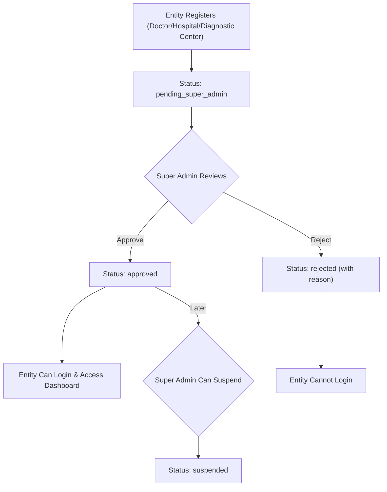

# Medify247 — Complete Project Analysis

> **Medify247** is a full-stack healthcare service platform that connects **Patients**, **Doctors**, **Hospitals**, **Diagnostic Centers**, and a **Super Admin** — all under a single, unified ecosystem with role-based access control, real-time notifications, and an approval workflow.

---

## 1. What Is Medify247?

Medify247 is a comprehensive **healthcare management platform** built for the Bangladesh/South-Asian healthcare context. It digitizes the entire patient-to-provider journey:

- Patients can **search doctors**, **book serial appointments**, **order diagnostic tests**, and **request home services** — all from a single dashboard.
- Doctors can **manage appointments**, **write digital prescriptions** (with PDF generation), and **track earnings**.
- Hospitals & Diagnostic Centers can **manage their doctors, tests, home services**, and **staff teams** with granular permissions.
- A Super Admin oversees the **entire platform**: approving/rejecting registrations, managing banners, broadcasting notifications, and exporting data.

---

## 2. Tech Stack

| Layer | Technology |
|-------|-----------|
| **Frontend** | React 19 + Vite 7, React Router v7, Axios |
| **Backend** | Node.js (ES Modules) + Express 4 |
| **Database** | MongoDB Atlas (Mongoose 8) |
| **Real-time** | Socket.IO (WebSocket) |
| **Auth** | JWT (jsonwebtoken) + bcryptjs |
| **File Uploads** | Multer → Cloudinary |
| **PDF Generation** | PDFKit |
| **Email** | Nodemailer (SMTP, configurable) |
| **Data Export** | XLSX + csv-writer |
| **Containerization** | Docker (Dockerfile provided) |

---

## 3. Architecture Overview

```
medify247/
├── backend/                    # Express API server (port 5000)
│   ├── server.js               # Entry point — Express + Socket.IO + MongoDB
│   ├── src/
│   │   ├── config/             # DB connection, Cloudinary config
│   │   ├── constants/          # RBAC permission definitions (4 role scopes)
│   │   ├── controllers/        # 13 controller files (~460KB of business logic)
│   │   ├── middlewares/        # Auth, RBAC permission, file upload middleware
│   │   ├── models/             # 28 Mongoose models
│   │   ├── routes/             # 11 route files
│   │   ├── services/           # Notification + HomeService serial booking
│   │   └── utils/              # JWT, OTP, PDF, Cloudinary, slot generation, staff
│   ├── scripts/                # Seed admin, fix indexes
│   └── Dockerfile
│
├── frontend/                   # React SPA (Vite, port 5173)
│   └── src/
│       ├── pages/              # 21 page components (41 files incl. CSS)
│       ├── components/         # Shared components (Navbar, modals)
│       ├── context/            # AuthContext (global auth state)
│       ├── config/             # Axios API client
│       └── utils/
│
└── README.md
```

---

## 4. User Roles & Access Control

Medify247 implements a **7-role RBAC** system:

| Role | Description | Dashboard |
|------|-------------|-----------|
| `patient` | End-user seeking healthcare | `/user/dashboard` |
| `doctor` | Independent or affiliated physician | `/doctor/dashboard` |
| `doctor_staff` | Staff member under a doctor's practice | `/doctor/dashboard` |
| `hospital_admin` | Hospital owner/administrator | `/hospital/dashboard` |
| `diagnostic_center_admin` | Diagnostic center owner/administrator | `/diagnostic-center/dashboard` |
| `super_admin` | Platform-wide administrator | `/super-admin/dashboard` |
| `super_admin_staff` | Staff with delegated super-admin permissions | `/super-admin/dashboard` |

### 4.1 Granular Permission System (RBAC)

Each entity type has its own permission set defined in `src/constants/`:

- **Super Admin Permissions** — 18 permissions across: dashboard, approvals, users, doctors, hospitals, diagnostic centers, banners, notifications, activity logs, data export, team management
- **Hospital Permissions** — Scoped to hospital operations (doctors, tests, home services, serials, orders, team, staff)
- **Diagnostic Center Permissions** — Similar to hospital but for diagnostic-specific workflows
- **Doctor Permissions** — Practice-level controls (appointments, prescriptions, chambers, earnings, team)

**Role Templates** assign pre-built permission bundles:
- `owner` → all permissions
- `admin` → all except team management
- `support`, `moderator`, `content_manager`, `viewer` → progressively restricted sets
- `custom` → hand-picked permissions

### 4.2 Staff Sub-Accounts

Each major entity (Super Admin, Hospital, Diagnostic Center, Doctor) can create **staff sub-accounts** with scoped permissions. Staff users authenticate through the main login and inherit restricted access based on their assigned permission set.

---

## 5. Feature Breakdown

### 5.1 🔐 Authentication & Authorization

- **Multi-portal registration**: Separate registration flows for Patients, Doctors, Hospitals, and Diagnostic Centers
- **Separate login portals**: `/login` (patients), `/doctor/login`, `/hospital/login`, `/diagnostic-center/login`, `/super-admin/login`
- **JWT-based sessions** with 7-day token expiry
- **Dual-table auth lookup**: Auth middleware checks both `Doctor` and `User` collections (doctors have their own table)
- **Public vs. Private routing**: React Router guards with role-based redirects
- **Auto-redirect on login**: Authenticated users redirected to their role-specific dashboard

---

### 5.2 👤 Patient (User) Features

| Feature | Description |
|---------|-------------|
| **Dashboard** | Full patient dashboard with tabs for appointments, tests, home services, prescriptions |
| **Search Doctors** | Search and filter doctors by name, specialization, hospital, location |
| **Book Appointments** | Serial-number-based appointment booking (not time-slot — mirrors Bangladesh clinical workflow) |
| **Order Diagnostic Tests** | Browse tests from hospitals/diagnostic centers, book test serials |
| **Home Services** | Request at-home services (doctor visits, sample collection, nursing) from hospitals/diagnostic centers |
| **View Prescriptions** | Access digital prescriptions with PDF download |
| **Profile Management** | Update personal info, address, date of birth, gender |
| **Notifications** | Real-time notifications (appointment updates, prescription ready, reports) |

---

### 5.3 🩺 Doctor Features

| Feature | Description |
|---------|-------------|
| **Registration** | Register with medical license, specialization, qualifications, experience — enters approval queue |
| **Multi-Association** | A single doctor can be associated with a Hospital AND a Diagnostic Center AND run an individual practice simultaneously |
| **Chamber Management** | Create/manage chambers with location, fees, contact info |
| **Appointment Management** | Accept/reject/complete appointments; view daily serial lists |
| **Prescription Writing** | Digital prescriptions with vitals, diagnosis (ICD codes), medicines, tests, advice, follow-up dates |
| **PDF Prescriptions** | Auto-generated prescription PDFs uploaded to Cloudinary |
| **Serial Settings** | Configure daily serial count, time range, available days, appointment price — per hospital, per diagnostic center, or individual |
| **Earnings Tracking** | Per-appointment earning records with platform fee deduction, payment status tracking |
| **Schedule Management** | Visiting days/times, holidays, emergency availability |
| **Staff Team (RBAC)** | Add staff members with custom permissions to help manage the practice |
| **Social Links** | Facebook, Twitter, LinkedIn, Instagram, Website |

---

### 5.4 🏥 Hospital Features

| Feature | Description |
|---------|-------------|
| **Registration** | Register with name, address, registration number, documents — enters approval queue |
| **Profile Management** | Logo, contact info, facilities, services, departments |
| **Doctor Management** | Associate doctors with the hospital (department, designation); configure doctor serial settings |
| **Test Management** | Create/manage diagnostic tests (name, code, category, price, preparation, duration) |
| **Test Packages** | Bundle multiple tests into discounted packages |
| **Test Serial Booking** | Configure serial settings for tests; patients can book test serials online |
| **Home Services** | Define home services (type, price, time range, off-days); receive and manage requests |
| **Home Service Serial Booking** | Serial-based booking for home services with configurable settings |
| **Order Management** | Track test orders (walk-in or home collection), update status, upload reports |
| **Appointment Overview** | View doctor appointments within the hospital |
| **Staff Team (RBAC)** | Add hospital staff with granular permissions |
| **Schedules** | Hospital-specific doctor schedules |

---

### 5.5 🔬 Diagnostic Center Features

| Feature | Description |
|---------|-------------|
| **Registration** | Detailed registration: name, owner info, trade license, contact details → approval queue |
| **Profile Management** | Operating hours, departments, staff counts, ambulance service, emergency service, reporting time, report delivery options, logo |
| **Test Management** | Full test CRUD with categories (pathology, radiology, cardiology, other) |
| **Test Serial Settings** | Configure serials per test for daily booking |
| **Home Services** | Home sample collection and other services with serial booking |
| **Home Service Requests** | Accept/reject/complete patient home service requests |
| **Doctor Association** | Associate doctors with the diagnostic center |
| **Doctor Serial Settings** | Configure serial settings for doctors operating in the center |
| **Staff Team (RBAC)** | Staff sub-accounts with scoped permissions |

---

### 5.6 🛡️ Super Admin Features

| Feature | Description |
|---------|-------------|
| **Dashboard** | Platform-wide overview with stats and analytics |
| **Approval System** | Approve/reject pending Doctors, Hospitals, and Diagnostic Centers with reasons |
| **User Management** | View all users, activate/deactivate/block accounts |
| **Doctor Management** | Platform-wide doctor oversight; suspend/reactivate |
| **Hospital Management** | Manage all hospitals; suspend/approve/reject |
| **Diagnostic Center Management** | Manage all diagnostic centers |
| **Banner Management** | Create/manage promotional banners (image, link, date range, active toggle, ordering) |
| **Broadcast Notifications** | Send platform-wide notifications to all users |
| **Activity Logs** | Audit trail of all approval/rejection/status-change actions |
| **Data Export** | Export platform data in XLSX/CSV formats |
| **Staff Team (RBAC)** | Create super admin staff accounts with role templates (Support Agent, Moderator, Content Manager, Viewer, Custom) |

---

### 5.7 🔔 Real-Time Notifications

Built on **Socket.IO**:
- Users join personal rooms (`user-{userId}`) on connection
- Server emits notifications for: appointment updates, prescription readiness, report uploads, order status changes, verification approvals/rejections, broadcast messages
- Notification types: `appointment_created`, `appointment_accepted`, `appointment_rejected`, `appointment_cancelled`, `appointment_rescheduled`, `appointment_reminder_24h`, `appointment_reminder_1h`, `prescription_ready`, `order_created`, `order_status_update`, `report_ready`, `verification_approved`, `verification_rejected`, `test_serial_booking`, `broadcast`

---

### 5.8 📄 Serial Booking System

A core differentiator — Medify247 uses a **serial-number-based appointment system** (common in South Asian clinics) rather than Western-style time-slot booking:

- **Doctor Serial Settings**: Per-doctor, per-location. Configurable: total serials/day, time range, available days, appointment price.
- **Test Serial Settings**: Per-test, per-institution. Same configurable options.
- **Home Service Serial Settings**: Serial booking for home services.
- **Date Serial Settings**: Fine-grained per-date overrides.
- **Slot Generator**: Utility that auto-generates time slots from serial settings.
- **Booking Flow**: Patient selects doctor/test → picks a date → system shows available serial numbers → patient books a serial.

---

### 5.9 📋 Prescription System

- **Rich prescriptions**: Vitals (BP, temp, heart rate, weight, height, BMI, SpO2), diagnosis (ICD codes), medicines (name, dosage, frequency, duration, before/after meal), recommended tests, advice, follow-up date.
- **PDF Generation**: PDFKit generates A4 prescription documents → uploaded to Cloudinary.
- **Serial List PDF**: Doctors can generate daily serial/appointment list PDFs.

---

### 5.10 🏠 Home Services

- Hospitals & Diagnostic Centers define services: home doctor visits, home nursing, sample collection, etc.
- Each service: type, price, available time window, off-days, activation toggle.
- **Request workflow**: Patient submits request → Provider accepts/rejects → Marks completed.
- **Serial booking**: Home services can also use serial-based booking.

---

### 5.11 ☁️ File Management

- **Multer** handles multipart uploads locally
- **Cloudinary** stores files permanently (images, documents, prescriptions, serial lists)
- Upload categories: profile photos, license documents, verification certificates, logos, banners, reports, prescriptions

---

## 6. Data Models (28 Mongoose Schemas)

| # | Model | Purpose |
|---|-------|---------|
| 1 | `User` | Patients, hospital admins, diagnostic center admins, super admins |
| 2 | `Doctor` | Doctors (separate table with own auth — not in Users table) |
| 3 | `Hospital` | Hospital profiles, associated doctors, verification status |
| 4 | `DiagnosticCenter` | Diagnostic center profiles with full operational details |
| 5 | `Appointment` | Doctor-patient appointments (serial-based) |
| 6 | `Prescription` | Digital prescriptions linked to appointments |
| 7 | `Chamber` | Doctor consultation chambers (location, fees) |
| 8 | `Test` | Diagnostic tests (can be packages bundling other tests) |
| 9 | `Order` | Test orders (walk-in or home collection) |
| 10 | `HomeService` | Home service definitions (type, price, schedule) |
| 11 | `HomeServiceRequest` | Patient requests for home services |
| 12 | `HomeServiceSerialBooking` | Serial-based bookings for home services |
| 13 | `HomeServiceSerialSettings` | Serial config for home services |
| 14 | `TestSerialBooking` | Serial-based bookings for diagnostic tests |
| 15 | `TestSerialSettings` | Serial config for tests |
| 16 | `SerialSettings` | Doctor appointment serial config (per-location) |
| 17 | `DateSerialSettings` | Per-date overrides for serial settings |
| 18 | `Schedule` | Doctor schedule definitions |
| 19 | `HospitalSchedule` | Hospital-specific doctor schedules |
| 20 | `Specialization` | Medical specialization master data |
| 21 | `Earning` | Doctor per-appointment earnings with platform fees |
| 22 | `Notification` | In-app notifications |
| 23 | `Approval` | Audit log of all approval/rejection actions |
| 24 | `Banner` | Promotional banners managed by super admin |
| 25 | `HospitalStaff` | Hospital staff sub-accounts with permissions |
| 26 | `DiagnosticCenterStaff` | Diagnostic center staff sub-accounts |
| 27 | `DoctorStaff` | Doctor practice staff sub-accounts |
| 28 | `SuperAdminStaff` | Super admin staff sub-accounts |

---

## 7. API Architecture

### Route Groups

| Prefix | File | Purpose |
|--------|------|---------|
| `/api/auth` | `auth.routes.js` | Login, Register (patients) |
| `/api/patient` | `patient.routes.js` | All patient operations |
| `/api/doctors` | `doctor.routes.js` | Doctor registration (public) |
| `/api/doctor` | `doctor.portal.routes.js` | Doctor portal (authenticated) |
| `/api/doctor-practice` | `doctor.practice.routes.js` | Doctor team & permissions (RBAC) |
| `/api/hospitals` | `hospital.routes.js` | Hospital registration + management |
| `/api/diagnostic-centers` | `diagnosticCenter.routes.js` | Diagnostic center full CRUD |
| `/api/admin` | `admin.routes.js` | Super admin operations |
| `/api/users` | `user.routes.js` | User profile endpoints |
| `/api/shared` | `shared.routes.js` | Shared/public endpoints |
| `/api/notifications` | `notification.routes.js` | Notification management |

### Middleware Pipeline

```
Request → CORS → JSON Parser → Route → authenticate → authorize(roles) →
  → [permissionMiddleware (RBAC check)] → Controller → Response
```

---

## 8. Frontend Page Architecture

| Page Component | Lines of Code | Description |
|---------------|---------------|-------------|
| `HospitalDashboard.jsx` | ~4,800 | Hospital management (most complex page) |
| `DiagnosticCenterDashboard.jsx` | ~4,200 | Diagnostic center management |
| `SuperAdminDashboard.jsx` | ~3,300 | Platform administration |
| `UserDashboard.jsx` | ~3,000 | Patient dashboard with all features |
| `DoctorDashboard.jsx` | ~2,400 | Doctor appointment/prescription management |
| `BookAppointment.jsx` | ~1,900 | Doctor/test booking flow |
| `DiagnosticCenterProfile.jsx` | ~1,000 | Diagnostic center profile editor |
| `SearchDoctors.jsx` | ~830 | Doctor search with filters |
| `HospitalProfile.jsx` | ~760 | Hospital profile management |
| `DiagnosticCenterRegister.jsx` | ~530 | Multi-field registration form |
| `SearchTests.jsx` | ~440 | Test search/browsing |
| `Navbar.jsx` | ~640 | Role-aware navigation bar |

---

## 9. Approval Workflow



- All Doctors, Hospitals, and Diagnostic Centers **must be approved** by Super Admin before they can operate.
- The `Approval` model maintains a full **audit trail** of every action.

---

## 10. Environment & Deployment

### Environment Variables

| Variable | Purpose |
|----------|---------|
| `PORT` | Backend port (default: 5000) |
| `NODE_ENV` | Environment (development/production) |
| `MONGO_URI` | MongoDB Atlas connection string |
| `JWT_SECRET` | JWT signing secret |
| `JWT_EXPIRE` | Token expiry (default: 7d) |
| `CLOUDINARY_*` | Cloudinary cloud name, API key, secret |
| `OTP_SECRET` | OTP generation secret |
| `EMAIL_*` | SMTP config for email sending |
| `FRONTEND_URL` | CORS origin (default: http://localhost:5173) |
| `MAX_FILE_SIZE` | Upload size limit (default: 5MB) |

### Deployment

- **Docker** ready with provided `Dockerfile`
- Backend exposes port 5000
- Frontend builds to `dist/` via Vite

---

## 11. Key Design Patterns

| Pattern | Where Used |
|---------|-----------|
| **Dual-table authentication** | Doctors stored separately from Users; auth middleware checks both |
| **Polymorphic ownership** | Tests, HomeServices, Orders, SerialBookings can belong to either Hospital OR DiagnosticCenter (mutual exclusion enforced via pre-save hooks) |
| **Role-based permission templates** | Pre-built role bundles (owner, admin, support, etc.) with custom override option |
| **Serial-number booking** | Culturally appropriate for South Asian healthcare — patients get a number, not a time slot |
| **Sparse unique indexes** | Handles nullable unique fields (e.g., doctor `bmdcNo`, `userId`) without MongoDB conflicts |
| **Cloud-first file storage** | Local Multer upload → Cloudinary → cleanup local file |
| **Audit trail** | All approval/rejection actions logged with actor, target, action, reason, timestamps |

---

## 12. Summary Statistics

| Metric | Count |
|--------|-------|
| Backend controllers | 13 |
| Backend models | 28 |
| Backend routes | 11 |
| Backend middleware | 8 |
| Frontend pages | 21 (41 files with CSS) |
| Frontend components | 4 shared components |
| User roles | 7 |
| Permission scopes | 4 (Super Admin, Hospital, Diagnostic Center, Doctor) |
| Real-time notification types | 15 |
| API route groups | 11 |
| Total backend source size | ~500KB+ of business logic |
| Total frontend source size | ~1MB+ of page components |

---

> **In summary**: Medify247 is a production-grade, multi-tenant healthcare platform with deep feature coverage for every stakeholder in the healthcare ecosystem — from patients booking serials to super admins governing the entire platform. Its serial-number-based booking system, multi-entity RBAC, and real-time notification infrastructure make it a robust foundation for a healthcare SaaS product.
