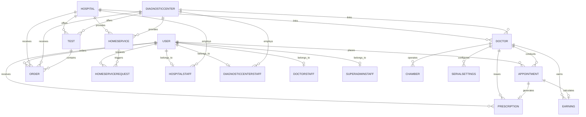
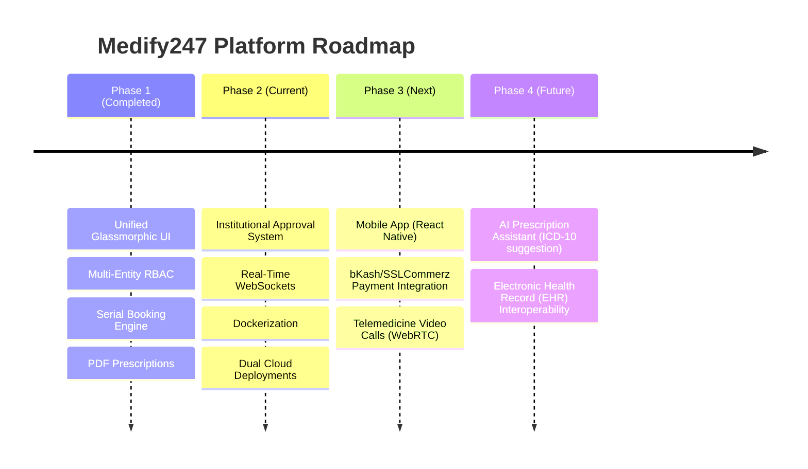

# Medify247 — Enterprise Architecture & Technical Specification

> **Medify247** is a production-grade, multi-tenant healthcare software-as-a-service (SaaS) platform tailored for South-Asian medical ecosystems. It unifies **Patients**, **Doctors**, **Hospitals**, **Diagnostic Centers**, and a **Super Admin** within a high-security, event-driven architecture featuring 7-role RBAC, real-time WebSocket notifications, serial-based scheduling, and automated PDF medical workflows.

---

## 1. Executive Summary & System Capabilities

- **Patients**: Multi-facility search, serial-number doctor booking, diagnostic lab ordering, home healthcare request dispatching, digital prescription vault with A4 PDF export, and real-time order tracking.
- **Doctors**: Multi-chamber management, serial slot configuration, structured digital prescription generator (ICD-10, vitals, multi-frequency medications), per-appointment earning ledger with platform commission calculations, and practice staff delegation.
- **Hospitals & Diagnostic Centers**: Institutional doctor linking, diagnostic test catalog management, bundled test packages, home care service management, walk-in/home collection order management, and RBAC team staff sub-accounts.
- **Super Admin**: Verification queue governance, account activation/suspension, platform banner engine, broadcast push notifications, data export (XLSX/CSV), and immutable audit logging.

---

## 2. Technical Stack Architecture

| Component | Stack Specification |
|---|---|
| **Frontend Framework** | React 19, Vite 7, React Router v7, Axios API Client |
| **UI Design System** | Modern Glassmorphism System (`AuthShared.css`), Vanilla CSS, CSS Variables |
| **Backend Runtime** | Node.js (ES Modules) + Express 4 framework |
| **Database Layer** | MongoDB Atlas (Mongoose 8 ODM) with index optimization |
| **Real-time Server** | Socket.IO (WebSocket room-isolated event architecture) |
| **Security & Auth** | JSON Web Tokens (JWT) + `bcryptjs` (salt factor 10) |
| **Cloud Storage** | Multer (local disk staging) → Cloudinary API (secure CDN bucket) |
| **Document Generation** | PDFKit (A4 prescription & serial list renderer) |
| **Data Pipelines** | `xlsx` (Excel engine) + `csv-writer` |
| **Deployment & Infra** | Vercel (Frontend SPA), Render / Hostinger VPS Docker Container (Backend) |

---

## 3. Entity Relationship Architecture (Mermaid ERD)



---

## 4. Complete Database Schema Definitions (28 Schemas)

### 4.1 Primary Identity & Auth Schemas
1. **`User`**: Core user entity (`name`, `email` [unique], `phone` [unique], `password`, `role` [`patient`, `hospital_admin`, `diagnostic_center_admin`, `super_admin`, `super_admin_staff`], `dateOfBirth`, `gender`, `address`, `isActive`, `isVerified`).
2. **`Doctor`**: Specialized physician entity (`name`, `email` [unique], `phone` [unique], `password`, `medicalLicenseNumber` [unique], `specialization` [Array], `qualifications`, `experienceYears`, `consultationFee`, `bio`, `profilePhotoUrl`, `status` [`pending_super_admin`, `approved`, `rejected`, `suspended`]).
3. **`Hospital`**: Institutional provider (`userId`, `name`, `registrationNumber` [unique], `address`, `phone`, `email`, `documents` [Array], `status` [`pending_super_admin`, `approved`, `rejected`, `suspended`], `admins` [Array]).
4. **`DiagnosticCenter`**: Diagnostic laboratory (`userId`, `name`, `tradeLicenseNumber` [unique], `ownerName`, `ownerPhone`, `address`, `status` [`pending_super_admin`, `approved`, `rejected`, `suspended`]).

### 4.2 Clinical & Scheduling Schemas
5. **`Appointment`**: Consultation record (`patientId`, `doctorId`, `chamberId`, `appointmentDate`, `appointmentNumber` [unique], `status` [`pending`, `accepted`, `rejected`, `completed`, `cancelled`, `no_show`], `fee`, `paymentStatus` [`pending`, `paid`, `refunded`], `serialNumber`).
6. **`Prescription`**: Medical record (`appointmentId`, `patientId`, `doctorId`, `vitals` [`bp`, `pulse`, `temperature`, `weight`, `height`, `bmi`, `spo2`], `diagnosis` [ICD-10 array], `medicines` [`name`, `dosage`, `frequency`, `duration`, `instructions`], `recommendedTests`, `advice`, `followUpDate`, `pdfUrl`).
7. **`Chamber`**: Practice location (`doctorId`, `hospitalId`, `diagnosticCenterId`, `name`, `address`, `consultationFee`, `phone`, `isActive`).
8. **`SerialSettings`**: Daily appointment capacity rules (`doctorId`, `locationType`, `hospitalId`, `diagnosticCenterId`, `totalSerialsPerDay`, `serialTimeRange` [`startTime`, `endTime`], `availableDays` [Array], `appointmentPrice`).
9. **`DateSerialSettings`**: Date-specific serial overrides (`doctorId`, `date`, `totalSerialsPerDay`, `isEnabled`, `adminNote`).
10. **`Schedule`**: Recurring doctor timetable (`doctorId`, `dayOfWeek`, `startTime`, `endTime`, `maxPatients`).
11. **`HospitalSchedule`**: Institution-controlled doctor schedule (`hospitalId`, `doctorId`, `dayOfWeek`, `startTime`, `endTime`).

### 4.3 Diagnostic & Home Healthcare Schemas
12. **`Test`**: Individual test or test package (`name`, `code`, `category` [`pathology`, `radiology`, `cardiology`, `other`], `price`, `duration`, `hospitalId`, `diagnosticCenterId`, `isPackage`, `includedTests` [Array]).
13. **`Order`**: Lab test invoice (`orderNumber` [unique], `patientId`, `hospitalId`, `diagnosticCenterId`, `tests` [Array], `totalAmount`, `discount`, `finalAmount`, `collectionType` [`walk_in`, `home_collection`], `paymentStatus` [`unpaid`, `paid`, `refunded`], `orderStatus` [`pending`, `confirmed`, `sample_collected`, `processing`, `completed`, `cancelled`], `reportUrls` [Array]).
14. **`TestSerialSettings`**: Lab test serial capacity rules (`testId`, `totalSerialsPerDay`, `serialTimeRange`, `availableDays`).
15. **`TestSerialBooking`**: Patient serial reservation for diagnostic tests (`testId`, `patientId`, `date`, `serialNumber`, `status`).
16. **`HomeService`**: At-home care definition (`serviceType`, `price`, `availableTime`, `offDays`, `hospitalId`, `diagnosticCenterId`, `isActive`).
17. **`HomeServiceRequest`**: Home care dispatch ticket (`requestNumber` [unique], `patientId`, `homeServiceId`, `patientName`, `patientAge`, `patientGender`, `homeAddress`, `contactPhone`, `preferredDate`, `preferredTime`, `status` [`pending`, `accepted`, `rejected`, `completed`, `cancelled`], `assignedStaff`).
18. **`HomeServiceSerialSettings`**: Home care serial capacity rules (`serviceId`, `totalSerialsPerDay`, `serialTimeRange`).
19. **`HomeServiceSerialBooking`**: Serial reservations for home care services.

### 4.4 Financial, System & RBAC Schemas
20. **`Earning`**: Ledger entry (`doctorId`, `appointmentId`, `month`, `year`, `consultationFee`, `platformFee`, `netAmount`, `status` [`pending`, `paid`, `cancelled`], `paymentMethod`, `transactionId`).
21. **`Specialization`**: Master specialty directory (`name`, `description`, `iconUrl`).
22. **`Notification`**: Real-time event log (`userId`, `title`, `message`, `type`, `isRead`, `link`).
23. **`Approval`**: Institutional audit log (`actorId`, `actorRole`, `targetType`, `targetId`, `action` [`register`, `approve`, `reject`, `suspend`, `reactivate`], `reason`, `previousStatus`, `newStatus`).
24. **`Banner`**: Marketing banner (`title`, `imageUrl`, `targetUrl`, `startDate`, `endDate`, `isActive`, `displayOrder`).
25. **`HospitalStaff`**: Sub-account (`hospitalId`, `userId`, `role`, `permissions` [Array], `isActive`).
26. **`DiagnosticCenterStaff`**: Sub-account (`diagnosticCenterId`, `userId`, `role`, `permissions` [Array], `isActive`).
27. **`DoctorStaff`**: Sub-account (`doctorId`, `userId`, `role`, `permissions` [Array], `isActive`).
28. **`SuperAdminStaff`**: Platform sub-account (`userId`, `role`, `permissions` [Array], `isActive`).

---

## 5. End-to-End Business Lifecycles

### 5.1 Complete Booking Lifecycle
```
1. Patient Selects Doctor & Chamber
2. System queries SerialSettings & DateSerialSettings for selected date
3. Slot Generator computes available serial numbers (1..N) and estimated arrival time
4. Patient confirms booking -> Server creates Appointment (status: pending, paymentStatus: pending)
5. Server emits real-time Socket.IO notification to Doctor room
6. Doctor/Practice Staff accepts appointment -> Status transitions to 'accepted'
7. Patient arrives at chamber -> Doctor conducts consultation
8. Doctor fills prescription form -> Prescription document saved & PDFKit generates A4 PDF -> Cloudinary Upload
9. Doctor marks appointment 'completed'
10. Server calculates platform commission -> Earning record created (status: pending)
```

### 5.2 Diagnostic Order Lifecycle
```
1. Patient selects Lab Tests / Packages from Hospital or Diagnostic Center
2. Selects collectionType: 'walk_in' or 'home_collection'
3. Server generates unique orderNumber (e.g. ORD-20260818-XXXX) -> Order created (status: pending)
4. Provider receives order notification -> Confirms order (status: confirmed)
5. If home_collection: Phlebotomist dispatched -> Status: sample_collected
6. Lab processes sample -> Status: processing
7. Lab uploads PDF report to Cloudinary -> Report URL attached -> Status: completed
8. Real-time notification sent to Patient -> Patient downloads PDF report from dashboard
```

### 5.3 Home Healthcare Dispatch Workflow
```
1. Patient submits HomeServiceRequest (patient info, address, preferred date/time)
2. Ticket created (status: pending, requestNumber: HSR-XXXXX)
3. Provider dashboard alerts home-care dispatcher
4. Dispatcher accepts ticket -> Assigns healthcare staff -> Status: accepted
5. Staff visits patient home & delivers service
6. Staff/Provider marks request 'completed'
```

---

## 6. Financial & Payment Architecture

Medify247 supports both cash and digital payment workflows:
- **Payment Gateway Integration Layer**: Ready for SSLCommerz / bKash / Nagad API integrations (`paymentStatus`: `pending`, `paid`, `refunded`; `paymentMethod`: `cash`, `card`, `online`, `mobile_banking`).
- **Platform Fee Engine**: Automatically deducts platform commission from doctor consultation fees upon appointment completion:
  $$\text{Net Earning} = \text{Consultation Fee} - \text{Platform Fee}$$
- **Earnings Ledger (`Earning.model.js`)**: Tracks monthly doctor payouts, payout methods (`bank_transfer`, `mobile_banking`), transaction IDs, and settlement status (`pending` vs. `paid`).

---

## 7. Institutional Approval States & Governance

All healthcare entities (`Doctor`, `Hospital`, `DiagnosticCenter`) follow strict status state machines:

| State | User `isActive` | Description |
|---|---|---|
| `pending_super_admin` | `false` | Registration submitted. Awaiting document verification by Super Admin. Cannot log in. |
| `approved` | `true` | Verified by Super Admin. Full dashboard access granted. |
| `rejected` | `false` | Registration declined. Rejection reason recorded in `Approval` audit log. Cannot log in. |
| `suspended` | `false` | Account suspended by Super Admin due to compliance issues. Access immediately revoked. |

---

## 8. Audit Logging & Security Specification

### 8.1 Audit Trail (`Approval.model.js`)
Every sensitive administrative action (approvals, rejections, suspensions, permission edits) creates an immutable record:
$$\text{Audit Record} = \{\text{actorId}, \text{actorRole}, \text{targetType}, \text{targetId}, \text{action}, \text{reason}, \text{previousStatus}, \text{newStatus}, \text{timestamp}\}$$

### 8.2 Security Specifications
- **Authentication**: JWT tokens signed with HMAC-SHA256 (`JWT_SECRET`), expiring in 7 days. Passed via HTTP `Authorization: Bearer <token>` headers.
- **Password Protection**: Salting and hashing via `bcryptjs` with salt factor 10. `select: false` enforced on Mongoose user schemas to prevent password leakage in queries.
- **Cross-Collection Unique Safeguards**: Pre-save queries cross-verify `email` and `phone` against both `User` and `Doctor` collections to prevent index collisions.
- **Transactional Rollback**: Institutional signup handlers execute atomic rollbacks (`User.findByIdAndDelete`) if secondary entity creation fails.

---

## 9. Media & File Management Architecture (Cloudinary)

```
File Input (Multipart/Form-Data) -> Local Staging (Multer /tmp) -> Cloudinary SDK Upload -> Secure HTTPS CDN URL -> Local Staging File Deleted
```
- **Categories Stored**: Doctor profile photos, medical licenses, hospital registration certificates, trade licenses, promotional banners, diagnostic PDF reports, and digital prescription PDFs.
- **Auto-Cleanup**: Temporary local files are immediately unlinked after successful Cloudinary upload to prevent container storage growth.

---

## 10. Real-Time Event Architecture (Socket.IO)

Clients establish WebSocket connections to backend server and join isolated rooms:
- **Personal Room**: `user-{userId}`
- **Institution Room**: `hospital-{hospitalId}`, `diagnostic-{centerId}`

### Event Payload Specifications

| Event Name | Trigger Context | Target Room |
|---|---|---|
| `appointment_created` | Patient books appointment | Doctor Room |
| `appointment_accepted` | Doctor accepts appointment | Patient Room |
| `appointment_completed` | Consultation finished | Patient Room |
| `prescription_ready` | Prescription PDF generated | Patient Room |
| `order_status_update` | Diagnostic lab updates status | Patient Room |
| `report_ready` | Lab report PDF uploaded | Patient Room |
| `verification_approved` | Super Admin approves provider | Provider Room |
| `broadcast` | Platform-wide admin announcement | All Connected Rooms |

---

## 11. Database Indexing & Concurrency Strategy

### 11.1 Indexing Matrix
- **`User`**: `{ email: 1 }` [unique], `{ phone: 1 }` [unique], `{ role: 1 }`
- **`Doctor`**: `{ email: 1 }` [unique], `{ phone: 1 }` [unique], `{ medicalLicenseNumber: 1 }` [unique]
- **`Hospital`**: `{ registrationNumber: 1 }` [unique], `{ userId: 1 }` [unique]
- **`DiagnosticCenter`**: `{ tradeLicenseNumber: 1 }` [unique], `{ userId: 1 }` [unique]
- **`Appointment`**: `{ appointmentNumber: 1 }` [unique], `{ doctorId: 1, appointmentDate: 1 }`, `{ patientId: 1 }`
- **`Order`**: `{ orderNumber: 1 }` [unique], `{ patientId: 1 }`, `{ hospitalId: 1 }`, `{ diagnosticCenterId: 1 }`

### 11.2 Concurrency & Race-Condition Guarding
- **Serial Number Allocation**: Computed atomically by querying current active appointments for the specific date and incrementing serial count inside Mongoose transactions.
- **Sparse Unique Indexes**: Nullable unique fields use Mongoose `sparse: true` index definitions to prevent duplicate key crashes on `null` values.

---

## 12. Frontend SPA Architecture & Design System

### 12.1 Page Component Directory

| Page Component | Lines of Code | Core Responsibility |
|---|---|---|
| `HospitalDashboard.jsx` | ~4,800 | Hospital entity portal (doctors, tests, home services, staff) |
| `DiagnosticCenterDashboard.jsx` | ~4,200 | Diagnostic lab portal (test catalog, serials, orders, staff) |
| `SuperAdminDashboard.jsx` | ~3,300 | Platform governance, approvals, banners, broadcasts, exports |
| `UserDashboard.jsx` | ~3,000 | Patient portal (appointments, tests, home care, prescriptions) |
| `DoctorDashboard.jsx` | ~2,400 | Doctor portal (queues, prescription writer, earnings, chambers) |
| `BookAppointment.jsx` | ~1,900 | Serial booking engine flow |
| `DiagnosticCenterProfile.jsx` | ~1,000 | Institutional profile editor |
| `SearchDoctors.jsx` | ~830 | Filtered doctor discovery engine |
| `HospitalProfile.jsx` | ~760 | Hospital profile editor |
| `DiagnosticCenterRegister.jsx` | ~530 | Institutional signup form |
| `SearchTests.jsx` | ~440 | Lab test discovery engine |

### 12.2 Modern Glassmorphism UI System (`AuthShared.css`)
- **Theme Variables**: Dark ambient gradient background (`#0f172a` $\to$ `#1e1b4b` $\to$ `#311042`) with glowing ambient backdrops.
- **Card Aesthetics**: Translucent white panels (`rgba(255, 255, 255, 0.96)`) with `backdrop-filter: blur(20px)`, rounded corners (`border-radius: 24px`), and subtle border highlights.

---

## 13. Production Operations, Disaster Recovery & DevOps

### 13.1 Production Architecture Diagram

```
                 [ Vercel CDN (Frontend SPA) ]
                              │
                    HTTPS REST & WebSockets
                              ▼
            [ Hostinger VPS / Render Docker Container ]
           ┌──────────────────────────────────────────┐
           │ Express API Engine + Socket.IO Server    │
           └────────────────────┬─────────────────────┘
                                │
                  ┌─────────────┴─────────────┐
                  ▼                           ▼
        [ MongoDB Atlas Cluster ]   [ Cloudinary Bucket CDN ]
        (Database & Indexes)        (PDFs, Reports, Images)
```

### 13.2 Environmental Variable Reference

| Variable | Purpose | Default / Example |
|---|---|---|
| `PORT` | Node server listening port | `5000` |
| `NODE_ENV` | Runtime environment | `production` |
| `MONGODB_URI` | MongoDB Atlas cluster connection string | `mongodb+srv://...` |
| `JWT_SECRET` | Secret key for signing JWT tokens | `super_secret_jwt_key` |
| `JWT_EXPIRE` | Token validity duration | `7d` |
| `CLOUDINARY_CLOUD_NAME` | Cloudinary storage bucket name | `medify247` |
| `CLOUDINARY_API_KEY` | Cloudinary API access key | `123456789` |
| `CLOUDINARY_API_SECRET` | Cloudinary API access secret | `secret_key` |
| `FRONTEND_URL` | Configured CORS allowed origin | `https://medify-247-psi.vercel.app` |

### 13.3 Backup, Disaster Recovery & Monitoring
- **Database Backups**: Automated MongoDB Atlas continuous cloud backups with point-in-time recovery (PITR) retention.
- **Logging & Diagnostics**: Console structured logging with express error handlers; unhandled rejections write formatted diagnostic stack traces.
- **Health Checks**: `/health` HTTP endpoint for automated uptime monitoring (Render / UptimeRobot).
- **Testing & Verification**: Production build verification via `npx vite build` and continuous automated route testing.

---

## 14. Project Roadmap



---

> **Summary**: Medify247 is a comprehensive, production-ready healthcare SaaS platform engineering the digital transformation of patient care, doctor consultation, lab diagnostics, and institutional healthcare management.
