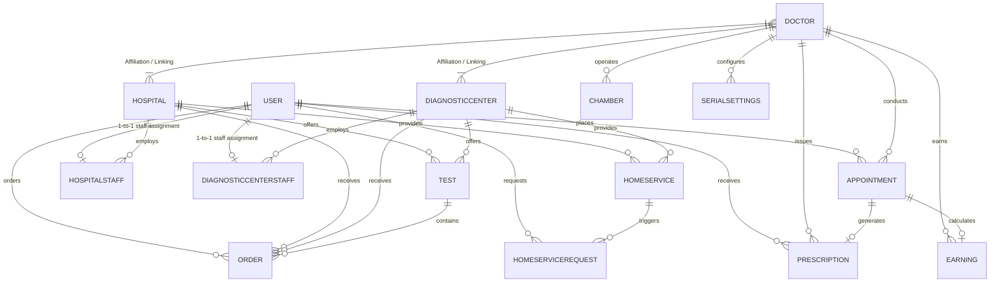
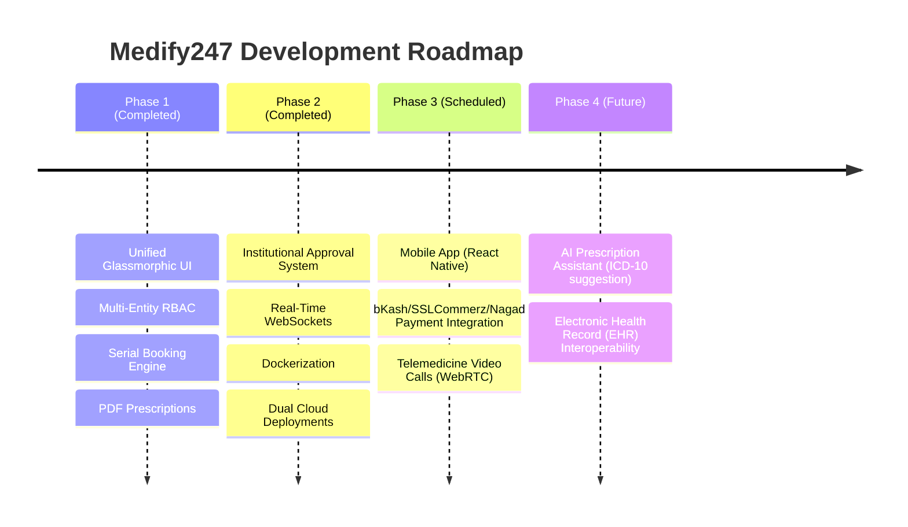

# Medify247 — Enterprise Architecture & Technical Specification

> **Medify247** is a production-deployed, multi-tenant healthcare software-as-a-service (SaaS) platform tailored for South-Asian medical ecosystems. It unifies **Patients**, **Doctors**, **Hospitals**, **Diagnostic Centers**, and a **Super Admin** within a tenant-isolated system featuring 7-role RBAC, real-time WebSocket notifications, serial-based scheduling, and automated PDF medical workflows.

---

## 📋 Feature Status & Implementation Matrix

| Capability / Feature | Status | Implementation Details |
|---|:---:|---|
| **7-Role Granular RBAC** | ✅ Implemented | Pre-defined role templates (`owner`, `admin`, `support`, etc.) + custom overrides |
| **Multi-Portal Architecture** | ✅ Implemented | Isolated login & registration flows per stakeholder |
| **Serial Booking Engine** | ✅ Implemented | Sequential serial calculation with date-specific overrides |
| **Digital Prescriptions** | ✅ Implemented | Structured clinical inputs (vitals, ICD-10 diagnosis, multi-dose medicines) |
| **A4 PDF Document Export** | ✅ Implemented | PDFKit automated rendering for prescriptions & daily appointment serial lists |
| **Socket.IO Real-Time Engine**| ✅ Implemented | Room-isolated event dispatching (`user-{id}`, `hospital-{id}`) |
| **Cloudinary Media Vault** | ✅ Implemented | Multer local staging $\to$ Cloudinary CDN stream $\to$ local file cleanup |
| **Institutional Approval System**| ✅ Implemented | `pending_super_admin` approval queue with audit logging |
| **Walk-in & Cash Payments** | ✅ Implemented | Cash/Offline payment handling & status tracking |
| **bKash / Nagad Mobile Banking**| 🟡 Planned (Phase 3) | Data models & abstraction layers ready; gateway integration scheduled |
| **SSLCommerz Card Gateway** | 🟡 Planned (Phase 3) | Prepared in database schema (`paymentStatus`, `transactionId`) |
| **Telemedicine Video Calls** | 🔵 Future (Phase 3) | WebRTC peer-to-peer video architecture planned |
| **AI Prescription Assistant** | 🔵 Future (Phase 4) | ICD-10 auto-complete & drug interaction warnings |
| **EHR Interoperability** | 🔵 Future (Phase 4) | HL7 / FHIR compliance module planned |

---

## 1. Multi-Tenant Data Isolation & Authorization Architecture

Medify247 is engineered as a **logical multi-tenant system** where each **Hospital** and **Diagnostic Center** acts as an isolated tenant node with boundary-scoped data access.

```
Super Admin Platform Governance
 ├── Hospital Tenant A
 │    ├── Affiliated Doctors (Junction-linked)
 │    ├── Staff Sub-Accounts (Scoped via HospitalStaff)
 │    ├── Test Catalog & Test Serials
 │    ├── Orders & Sample Requests
 │    └── Home Care Offerings
 └── Hospital Tenant B
      ├── Affiliated Doctors
      ├── Staff Sub-Accounts
      ├── Test Catalog
      └── Home Care Offerings
```

### 1.1 Tenant Boundary Isolation & Security Rules
- **Data Scoping**: Every resource (`Test`, `Order`, `HomeService`, `TestSerialBooking`, `HospitalStaff`) contains mandatory indexed foreign keys (`hospitalId` or `diagnosticCenterId`).
- **Middleware Boundary Guards (`hospitalGuard` & `diagnosticCenterGuard`)**: 
  1. Requests pass through `authenticate` (verifies JWT identity).
  2. Router invokes `hospitalGuard(requiredPermission)` which extracts `hospitalId` from URL parameters.
  3. Guard verifies if the authenticated user is either the primary tenant owner OR an active `HospitalStaff` / `DiagnosticCenterStaff` member belonging strictly to `req.params.hospitalId` with the required permission grant.
  4. Cross-tenant requests (e.g. Staff from Hospital A requesting `/api/hospitals/HOSPITAL_B/doctors`) are rejected with `403 Forbidden`.

---

## 2. Technical Stack Architecture

| Layer | Technology & Version |
|---|---|
| **Frontend Framework** | React 19, Vite 7, React Router v7, Axios API Client |
| **UI Design System** | Modern Glassmorphism System (`AuthShared.css`), Vanilla CSS, CSS Variables |
| **Backend Runtime** | Node.js (ES Modules) + Express 4 framework |
| **Database Layer** | MongoDB Atlas (Mongoose 8 ODM) with indexed query execution |
| **Real-time Server** | Socket.IO (WebSocket room-isolated event architecture) |
| **Security & Auth** | JSON Web Tokens (JWT) + `bcryptjs` (salt factor 10) |
| **Cloud Storage** | Multer (local disk staging) $\to$ Cloudinary API (secure CDN bucket) |
| **Document Generation** | PDFKit (A4 prescription & serial list renderer) |
| **Data Pipelines** | `xlsx` (Excel engine) + `csv-writer` |
| **Deployment & Infra** | Vercel (Frontend SPA), Render / Hostinger VPS Docker Container (Backend) |

---

## 3. Entity Relationship Architecture (Corrected ERD)



---

## 4. Complete Database Schema Definitions (28 Schemas)

### 4.1 Primary Identity & Auth Schemas
1. **`User`**: Core user entity (`name`, `email` [unique], `phone` [unique], `password`, `role` [`patient`, `hospital_admin`, `diagnostic_center_admin`, `super_admin`, `super_admin_staff`], `dateOfBirth`, `gender`, `address`, `isActive`, `isVerified`).
2. **`Doctor`**: Specialized physician entity (`name`, `email` [unique], `phone` [unique], `password`, `medicalLicenseNumber` [unique], `specialization` [Array], `qualifications`, `experienceYears`, `consultationFee`, `bio`, `profilePhotoUrl`, `status` [`pending_super_admin`, `approved`, `rejected`, `suspended`]).
3. **`Hospital`**: Institutional provider (`userId`, `name`, `registrationNumber` [unique], `address`, `phone`, `email`, `documents` [Array], `status` [`pending_super_admin`, `approved`, `rejected`, `suspended`], `admins` [Array]).
4. **`DiagnosticCenter`**: Diagnostic laboratory (`userId`, `name`, `tradeLicenseNumber` [unique], `ownerName`, `ownerPhone`, `address`, `status` [`pending_super_admin`, `approved`, `rejected`, `suspended`]).

### 4.2 Clinical & Scheduling Schemas
5. **`Appointment`**: Consultation record (`patientId`, `doctorId`, `chamberId`, `appointmentDate`, `appointmentNumber` [unique], `status` [`pending`, `accepted`, `rejected`, `completed`, `cancelled`, `no_show`], `fee`, `paymentStatus` [`pending`, `paid`, `refunded`], `paymentMethod` [`cash`, `card`, `online`], `serialNumber`).
6. **`Prescription`**: Medical record (`appointmentId`, `patientId`, `doctorId`, `vitals` [`bp`, `pulse`, `temperature`, `weight`, `height`, `bmi`, `spo2`], `diagnosis` [ICD-10 array], `medicines` [`name`, `dosage`, `frequency`, `duration`, `instructions`], `recommendedTests`, `advice`, `followUpDate`, `pdfUrl`).
7. **`Chamber`**: Practice location (`doctorId`, `hospitalId`, `diagnosticCenterId`, `name`, `address`, `consultationFee`, `phone`, `isActive`).
8. **`SerialSettings`**: Daily appointment capacity rules (`doctorId`, `locationType`, `hospitalId`, `diagnosticCenterId`, `totalSerialsPerDay`, `serialTimeRange` [`startTime`, `endTime`], `availableDays` [Array], `appointmentPrice`).
9. **`DateSerialSettings`**: Date-specific serial overrides (`doctorId`, `date`, `totalSerialsPerDay`, `isEnabled`, `adminNote`).
10. **`Schedule`**: Recurring doctor timetable (`doctorId`, `dayOfWeek`, `startTime`, `endTime`, `maxPatients`).
11. **`HospitalSchedule`**: Institution-controlled doctor schedule (`hospitalId`, `doctorId`, `dayOfWeek`, `startTime`, `endTime`).

### 4.3 Diagnostic & Home Healthcare Schemas
12. **`Test`**: Individual test or test package (`name`, `code`, `category` [`pathology`, `radiology`, `cardiology`, `other`], `price`, `duration`, `hospitalId`, `diagnosticCenterId`, `isPackage`, `includedTests` [Array]).
13. **`Order`**: Lab test invoice (`orderNumber` [unique], `patientId`, `hospitalId`, `diagnosticCenterId`, `tests` [Array], `totalAmount`, `discount`, `finalAmount`, `collectionType` [`walk_in`, `home_collection`], `paymentStatus` [`unpaid`, `paid`, `refunded`], `orderStatus` [`pending`, `confirmed`, `sample_collected`, `processing`, `completed`, `cancelled`], `reportUrls` [Array]).
14. **`TestSerialSettings`**: Lab test serial capacity rules (`testId`, `totalSerialsPerDay`, `serialTimeRange`, `availableDays`).
15. **`TestSerialBooking`**: Patient serial reservation for diagnostic tests (`testId`, `patientId`, `date`, `serialNumber`, `status`).
16. **`HomeService`**: At-home care definition (`serviceType`, `price`, `availableTime`, `offDays`, `hospitalId`, `diagnosticCenterId`, `isActive`).
17. **`HomeServiceRequest`**: Home care dispatch ticket (`requestNumber` [unique], `patientId`, `homeServiceId`, `patientName`, `patientAge`, `patientGender`, `homeAddress`, `contactPhone`, `preferredDate`, `preferredTime`, `status` [`pending`, `accepted`, `rejected`, `completed`, `cancelled`], `assignedStaff`).
18. **`HomeServiceSerialSettings`**: Home care serial capacity rules (`serviceId`, `totalSerialsPerDay`, `serialTimeRange`).
19. **`HomeServiceSerialBooking`**: Serial reservations for home care services.

### 4.4 Financial, System & RBAC Schemas
20. **`Earning`**: Ledger entry (`doctorId`, `appointmentId`, `month`, `year`, `consultationFee`, `platformFee`, `netAmount`, `status` [`pending`, `paid`, `cancelled`], `paymentMethod`, `transactionId`).
21. **`Specialization`**: Master specialty directory (`name`, `description`, `iconUrl`).
22. **`Notification`**: Real-time event log (`userId`, `title`, `message`, `type`, `isRead`, `link`).
23. **`Approval`**: Institutional audit log (`actorId`, `actorRole`, `targetType`, `targetId`, `action` [`register`, `approve`, `reject`, `suspend`, `reactivate`], `reason`, `previousStatus`, `newStatus`).
24. **`Banner`**: Marketing banner (`title`, `imageUrl`, `targetUrl`, `startDate`, `endDate`, `isActive`, `displayOrder`).
25. **`HospitalStaff`**: Sub-account (`hospitalId`, `userId`, `role`, `permissions` [Array], `isActive`).
26. **`DiagnosticCenterStaff`**: Sub-account (`diagnosticCenterId`, `userId`, `role`, `permissions` [Array], `isActive`).
27. **`DoctorStaff`**: Sub-account (`doctorId`, `userId`, `role`, `permissions` [Array], `isActive`).
28. **`SuperAdminStaff`**: Platform sub-account (`userId`, `role`, `permissions` [Array], `isActive`).

---

## 5. End-to-End Business Lifecycles & State Transitions

### 5.1 Complete Booking & Payment Lifecycle (With Edge Cases)
```
[ Patient Selects Doctor & Date ]
              │
              ▼
[ Compute Available Serials (1..N) ]
              │
              ▼
[ Patient Submits Booking ] ────► ( Payment Failure / Cancellation ) ──► [ Status: cancelled ]
              │                                                             [ PaymentStatus: refunded ]
              ▼
[ Appointment Created (status: pending, paymentStatus: pending/paid) ]
              │
              ├──► ( Doctor Rejects ) ──► [ Status: rejected ] ──► [ Trigger Refund Workflow ]
              │
              ▼
[ Doctor Accepts (status: accepted) ]
              │
              ├──► ( Patient No-Show ) ──► [ Status: no_show ]
              │
              ▼
[ Consultation Conducted ] ──► [ Digital Prescription Generated & PDF Exported ]
              │
              ▼
[ Status: completed ] ──► [ Platform Fee Deducted ] ──► [ Earning Record Generated ]
```

---

## 6. Payment Architecture

**Payment Architecture Prepared**: Medify247 currently implements **Cash / On-Site** and manual payment workflows. The database models (`Appointment`, `Order`, `Earning`) include dedicated payment fields (`paymentStatus`: `pending`, `paid`, `refunded`; `paymentMethod`: `cash`, `card`, `online`, `mobile_banking`; `transactionId`). Integration with automated digital gateways (**SSLCommerz**, **bKash**, **Nagad**) is scheduled for **Phase 3** of the product roadmap.

### Financial Settlement Math
Upon consultation completion:
$$\text{Net Earning} = \text{Consultation Fee} - \text{Platform Fee}$$

---

## 7. API Reference Specification

### 7.1 Key Endpoints Summary Matrix

| Method | Endpoint Route | Access / Auth | Description |
|---|---|---|---|
| `POST` | `/api/auth/register` | Public | Register patient account |
| `POST` | `/api/auth/login` | Public | Multi-portal authentication & JWT issue |
| `GET` | `/api/shared/doctors` | Public | Search verified doctors with filters |
| `GET` | `/api/shared/hospitals` | Public | Search registered hospitals |
| `GET` | `/api/shared/tests` | Public | Search diagnostic test catalog |
| `POST` | `/api/patient/appointments` | Patient JWT | Book serial-based doctor appointment |
| `GET` | `/api/patient/appointments` | Patient JWT | Fetch patient booking history |
| `PUT` | `/api/doctor/appointments/:id/status` | Doctor JWT | Accept, reject, or complete appointment |
| `POST` | `/api/doctor/prescriptions` | Doctor JWT | Create digital prescription & generate PDF |
| `POST` | `/api/hospitals/register` | Public | Hospital registration submission |
| `POST` | `/api/diagnostic-centers/register` | Public | Diagnostic center registration submission |
| `POST` | `/api/admin/approve/:entityType/:id` | Super Admin JWT | Approve pending provider application |

### 7.2 Standard Error Response Contract
All API endpoints return standard JSON error structures:
```json
{
  "success": false,
  "message": "Validation failed",
  "errors": [
    { "field": "phone", "msg": "Valid phone number is required" }
  ]
}
```

---

## 8. Serial Calculation & Concurrency Handling

- **Serial Number Allocation**: Calculated dynamically by inspecting existing non-cancelled bookings for the specified doctor/chamber/date combination:
  $$\text{Next Serial} = \text{Count}(\text{Existing Active Bookings}) + 1$$
- **Concurrency Strategy**: Enforced via atomic database pre-checks and Mongoose compound unique indexes (`{ doctorId: 1, chamberId: 1, appointmentDate: 1, serialNumber: 1 }`). Duplicate index collisions trigger a clean 400 error requiring the user to refresh serial options.

---

## 9. Environmental Variable Specification

> [!CAUTION]
> **Production Notice**: Place exact credentials inside your deployment server's environment settings. Never commit actual secret keys to repository source code.

| Variable | Purpose | Placeholder / Format |
|---|---|---|
| `PORT` | Server listening port | `5000` |
| `NODE_ENV` | Environment scope | `production` |
| `MONGODB_URI` | MongoDB connection string | `mongodb+srv://<USER>:<PASSWORD>@<CLUSTER>.mongodb.net/<DB>?retryWrites=true&w=majority` |
| `JWT_SECRET` | Token signature secret | `<YOUR_JWT_SECRET_KEY>` |
| `JWT_EXPIRE` | Token expiration duration | `7d` |
| `CLOUDINARY_CLOUD_NAME` | Cloudinary storage bucket | `<YOUR_CLOUDINARY_CLOUD_NAME>` |
| `CLOUDINARY_API_KEY` | Cloudinary API access key | `<YOUR_CLOUDINARY_API_KEY>` |
| `CLOUDINARY_API_SECRET` | Cloudinary API access secret | `<YOUR_CLOUDINARY_API_SECRET>` |
| `FRONTEND_URL` | Allowed CORS origin | `<YOUR_FRONTEND_DOMAIN>` |

---

## 10. Quality Assurance & Testing Strategy

- **Build Verification**: Production frontend compilations are validated via `npx vite build` (verifying AST transformations and CSS minification across 144 modules).
- **Implementation Status**:
  - **Unit Tests**: Planned (Phase 3)
  - **Integration & Route Tests**: Planned (Phase 3)
  - **End-to-End (E2E) Tests**: Planned (Phase 3)
  - **Load & Concurrency Testing**: Planned (Phase 3)

---

## 11. Production Architecture Diagram

```
                 [ Vercel CDN (Frontend SPA) ]
                              │
                    HTTPS REST & WebSockets
                              ▼
            [ Hostinger VPS / Render Docker Container ]
           ┌──────────────────────────────────────────┐
           │ Express API Engine + Socket.IO Server    │
           └────────────────────┬─────────────────────┘
                                │
                  ┌─────────────┴─────────────┐
                  ▼                           ▼
        [ MongoDB Atlas Cluster ]   [ Cloudinary Bucket CDN ]
        (Database & Indexes)        (PDFs, Reports, Images)
```

---

## 12. Project Roadmap



---

> **Summary**: Medify247 is a feature-complete, multi-tenant healthcare SaaS platform digitizing patient scheduling, clinical prescriptions, diagnostic lab operations, and platform governance.
