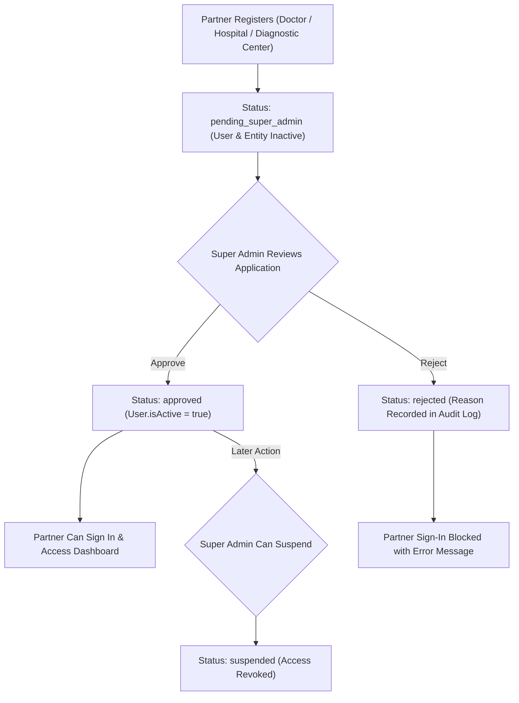

# Medify247 — Complete Project Overview & Technical Architecture

> **Medify247** is an enterprise-grade, multi-tenant healthcare service platform built for the South-Asian healthcare ecosystem. It connects **Patients**, **Doctors**, **Hospitals**, **Diagnostic Centers**, and a **Super Admin** within a unified system featuring granular Role-Based Access Control (RBAC), real-time WebSocket notifications, serial-based appointment scheduling, and strict approval workflows.

---

## 1. What Is Medify247?

Medify247 digitizes the end-to-end patient and healthcare provider lifecycle:

- **Patients**: Search doctors by specialization/location, book serial-based appointments, order lab tests, request home services (nursing, sample collection), view digital prescriptions, and download PDF medical reports.
- **Doctors**: Manage daily appointment queues, configure multi-location chambers and schedules, write structured digital prescriptions (vitals, ICD-10 diagnosis, medications, follow-ups), track earnings, and assign practice staff.
- **Hospitals & Diagnostic Centers**: Manage affiliated doctors, diagnostic tests and test packages, home service offerings, test/home-service serial bookings, and staff teams with scoped permissions.
- **Super Admin**: Oversee entity registration approvals/rejections, manage platform banners, broadcast notifications, monitor audit logs, manage users, and export system analytics.

---

## 2. Tech Stack

| Layer | Technology & Version |
|---|---|
| **Frontend** | React 19 + Vite 7, React Router v7, Axios, Glassmorphism UI Design System |
| **Backend** | Node.js (ES Modules) + Express 4 |
| **Database** | MongoDB Atlas (Mongoose 8) |
| **Real-time** | Socket.IO (WebSocket room-based architecture) |
| **Authentication** | JWT (jsonwebtoken) + bcryptjs (7-day token duration) |
| **File Storage** | Multer (local temporary staging) → Cloudinary (permanent cloud storage) |
| **PDF Generation** | PDFKit (A4 prescription & serial list generation) |
| **Notifications** | Socket.IO real-time events + Nodemailer (SMTP integration) |
| **Data Export** | XLSX + csv-writer |
| **Deployment** | Vercel (Frontend), Render / Hostinger VPS (Backend Docker container) |

---

## 3. Architecture & Folder Structure

```
medify247/
├── backend/                        # Express REST API & Socket.IO server (Port 5000)
│   ├── server.js                   # Entry point: Server initialization, CORS, Socket.IO, DB connect
│   ├── Dockerfile                  # Production container definition
│   ├── scripts/                    # Database seeding (createSuperAdmin.js) & index maintenance
│   └── src/
│       ├── config/                 # MongoDB Atlas connection & Cloudinary initialization
│       ├── constants/              # Granular RBAC definitions (Super Admin, Hospital, Diagnostic, Doctor)
│       ├── controllers/            # 13 Controllers (~470KB business logic)
│       ├── middlewares/            # Auth, RBAC guards, file uploaders & error handlers
│       ├── models/                 # 28 Mongoose schemas
│       ├── routes/                 # 11 API Route definitions
│       ├── services/               # Notification service & HomeService serial booking engine
│       └── utils/                  # JWT, OTP, PDF generator, Cloudinary & slot calculators
│
├── frontend/                       # React SPA (Vite, Port 5173 / Production Vercel)
│   ├── vercel.json                 # Vercel SPA routing rewrite rules
│   └── src/
│       ├── config/                 # Axios instance configuration (`api.js`)
│       ├── context/                # AuthContext (global authentication state & handlers)
│       ├── pages/                  # 21 Page components + `AuthShared.css` design system
│       │   ├── AuthShared.css      # Shared glassmorphism CSS design system for all auth forms
│       │   ├── Login.jsx           # Unified multi-role login page
│       │   ├── Register.jsx        # Patient registration page
│       │   ├── DoctorRegister.jsx  # Doctor application form
│       │   ├── HospitalRegister.jsx# Hospital application form
│       │   ├── DiagnosticCenterRegister.jsx # Diagnostic center application form
│       │   ├── DoctorDashboard.jsx # Doctor portal
│       │   ├── HospitalDashboard.jsx # Hospital portal (~4,800 lines)
│       │   ├── DiagnosticCenterDashboard.jsx # Diagnostic portal (~4,200 lines)
│       │   ├── SuperAdminDashboard.jsx # Platform admin portal (~3,300 lines)
│       │   └── UserDashboard.jsx   # Patient portal (~3,000 lines)
│       └── components/             # Shared UI components (Navbar, Modals, Filters)
│
├── USER_CREDENTIALS.md             # Active account credentials reference
└── PROJECT_OVERVIEW.md             # Project technical documentation
```

---

## 4. User Roles & Access Control (7-Role RBAC)

Medify247 enforces strict multi-portal RBAC across 7 roles:

| Role | Access Scope | Portal Route |
|---|---|---|
| `patient` | End-user seeking healthcare & booking services | `/user/dashboard` |
| `doctor` | Independent or institution-affiliated physician | `/doctor/dashboard` |
| `doctor_staff` | Delegated staff member under a doctor's practice | `/doctor/dashboard` |
| `hospital_admin` | Hospital owner or administrator | `/hospital/dashboard` |
| `diagnostic_center_admin` | Diagnostic center owner or administrator | `/diagnostic-center/dashboard` |
| `super_admin` | Platform-wide administrator with full control | `/super-admin/dashboard` |
| `super_admin_staff` | Delegated admin staff with assigned permission sets | `/super-admin/dashboard` |

### 4.1 Granular RBAC Permissions

Permissions are defined in `src/constants/`:
- **Super Admin Permissions**: Dashboard, approvals, user management, doctor oversight, hospital oversight, diagnostic center oversight, banner management, notification broadcast, activity audit logs, data export, staff management.
- **Hospital Permissions**: Manage hospital doctors, test catalog, test serials, home services, home service serials, orders, and hospital staff.
- **Diagnostic Center Permissions**: Manage lab tests, test serials, home services, home requests, center doctors, and staff.
- **Doctor Permissions**: Manage appointments, write prescriptions, manage chambers, schedule settings, serial pricing, earnings, and practice staff.

### 4.2 Staff Sub-Accounts
Institutions (Super Admin, Hospital, Diagnostic Center, Doctor) can invite staff sub-accounts using pre-defined role templates (`owner`, `admin`, `support`, `moderator`, `content_manager`, `viewer`, `custom`). Staff members log in through standard portals and inherit restricted permissions.

---

## 5. Core System Workflows & Features

### 5.1 🔐 Unified Glassmorphic Auth System
- **Single Shared CSS Design System (`AuthShared.css`)**: Dark-ambient theme with glassmorphic cards (`backdrop-filter: blur(20px)`), brand badges, and responsive form grids.
- **Cross-Collection Duplicate Protection**: Prevents duplicate email/phone registrations across both `User` and `Doctor` collections, preventing MongoDB `E11000` duplicate key index crashes.
- **Transactional Rollback**: In institution registrations (`registerDiagnosticCenter`, `registerHospital`), if institutional record creation fails after user creation, the system automatically rolls back and deletes the orphan user record.
- **Public Partner Cross-Navigation**: Every registration page features interactive cards for cross-registering as a Patient, Doctor, Hospital, or Diagnostic Center.

---

### 5.2 🛡️ Approval & Audit Workflow



- All institutional partners enter a `pending_super_admin` queue upon registration.
- Every approval/rejection/suspension is recorded in the `Approval` collection for audit logging.

---

### 5.3 📅 Serial-Based Appointment & Booking Engine

Designed specifically for South-Asian clinical practices:
- **Serial Numbers vs. Time Slots**: Patients book sequential serial numbers (e.g. Serial #1, Serial #2) rather than rigid Western time slots.
- **Doctor Serial Settings**: Per-doctor, per-location settings (total serials/day, operating time range, available days, consultation fee).
- **Date-Specific Overrides**: Doctors/Hospitals can override serial counts or disable serials on specific dates via `DateSerialSettings`.
- **Test & Home Service Serials**: Hospitals and Diagnostic Centers can configure serial booking rules for high-demand lab tests and home care requests.

---

### 5.4 🩺 Digital Prescription & PDF Engine
- **Clinical Data Structure**: Vitals (BP, Pulse, Temp, Weight, Height, BMI, SpO2), ICD-10 diagnosis, medication instructions (dosage, timing, meal relations, duration), recommended tests, advice, and follow-up dates.
- **Automated PDF Generation**: `PDFKit` generates printable A4 prescription documents on demand, uploaded automatically to Cloudinary.

---

### 5.5 🔔 Real-Time WebSocket Notifications
- Built with **Socket.IO** using isolated user rooms (`user-{userId}`).
- Emits instant updates for appointment status changes, prescription readiness, report uploads, verification approvals, and platform broadcasts.

---

## 6. Data Models (28 Mongoose Schemas)

| # | Model Schema | Purpose & Scope |
|---|---|---|
| 1 | `User` | Patient, Hospital Admin, Diagnostic Admin, Super Admin, Admin/Staff accounts |
| 2 | `Doctor` | Doctor accounts (separate table with independent auth & medical credentials) |
| 3 | `Hospital` | Hospital entity profiles, departments, facilities, license numbers, status |
| 4 | `DiagnosticCenter` | Diagnostic center profiles, owner info, trade license details, status |
| 5 | `Appointment` | Serial-based doctor-patient appointments |
| 6 | `Prescription` | Digital clinical prescriptions with Cloudinary PDF links |
| 7 | `Chamber` | Doctor consultation locations and fees |
| 8 | `Test` | Diagnostic tests and test package definitions |
| 9 | `Order` | Diagnostic test orders (walk-in or home collection) |
| 10 | `HomeService` | At-home healthcare service definitions |
| 11 | `HomeServiceRequest` | Patient requests for home healthcare services |
| 12 | `HomeServiceSerialBooking` | Serial bookings for home healthcare services |
| 13 | `HomeServiceSerialSettings` | Serial configuration for home services |
| 14 | `TestSerialBooking` | Serial bookings for diagnostic lab tests |
| 15 | `TestSerialSettings` | Serial configuration for diagnostic tests |
| 16 | `SerialSettings` | Doctor serial appointment configuration per location |
| 17 | `DateSerialSettings` | Fine-grained date-specific serial overrides |
| 18 | `Schedule` | Doctor regular schedule definitions |
| 19 | `HospitalSchedule` | Hospital-specific doctor schedules |
| 20 | `Specialization` | Master list of medical specializations |
| 21 | `Earning` | Doctor per-appointment earnings & platform fee records |
| 22 | `Notification` | System and real-time in-app notifications |
| 23 | `Approval` | Platform approval & audit trail log |
| 24 | `Banner` | Promotional banners managed by Super Admin |
| 25 | `HospitalStaff` | Staff sub-accounts for hospitals with permissions |
| 26 | `DiagnosticCenterStaff` | Staff sub-accounts for diagnostic centers |
| 27 | `DoctorStaff` | Staff sub-accounts for doctor practices |
| 28 | `SuperAdminStaff` | Staff sub-accounts for platform admin team |

---

## 7. API Architecture & Middleware Pipeline

```
Client Request → CORS → Body Parser → Express Router → authenticate (JWT) → authorize (Role) → hospitalGuard / diagnosticCenterGuard (RBAC) → Controller → Response
```

### Route Index

| Route Prefix | File Name | Description |
|---|---|---|
| `/api/auth` | `auth.routes.js` | Patient registration, multi-role login, OTP endpoints |
| `/api/doctors` | `doctor.routes.js` | Public doctor registration |
| `/api/doctor` | `doctor.portal.routes.js` | Doctor portal endpoints (appointments, prescriptions, serials) |
| `/api/doctor-practice` | `doctor.practice.routes.js` | Doctor practice team RBAC |
| `/api/hospitals` | `hospital.routes.js` | Hospital registration & management APIs |
| `/api/diagnostic-centers` | `diagnosticCenter.routes.js` | Diagnostic center registration & management APIs |
| `/api/admin` | `admin.routes.js` | Super Admin platform control & approvals |
| `/api/patient` | `patient.routes.js` | Patient booking, test ordering, prescription viewing |
| `/api/users` | `user.routes.js` | Profile management |
| `/api/shared` | `shared.routes.js` | Public search (doctors, hospitals, diagnostic centers, tests) |
| `/api/notifications` | `notification.routes.js` | In-app notification management |

---

## 8. Deployment Infrastructure

- **Frontend (Vercel)**:
  - Repository root: `frontend/`
  - Output directory: `dist/`
  - SPA Rewrite Rules configured in `frontend/vercel.json`.
- **Backend (Render / Hostinger VPS)**:
  - Production Docker setup via `Dockerfile`.
  - Environment variables: `MONGODB_URI`, `JWT_SECRET`, `CLOUDINARY_*`, `VITE_API_BASE_URL`.
